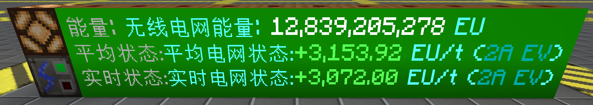
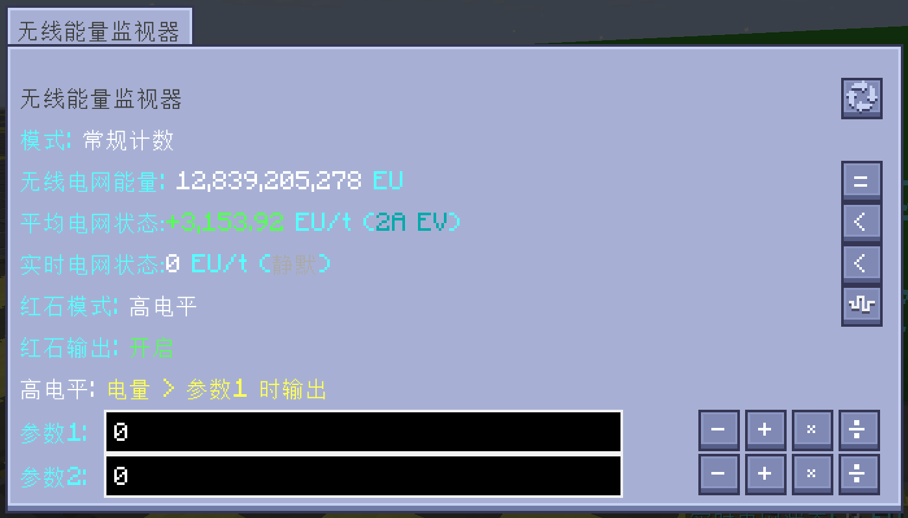
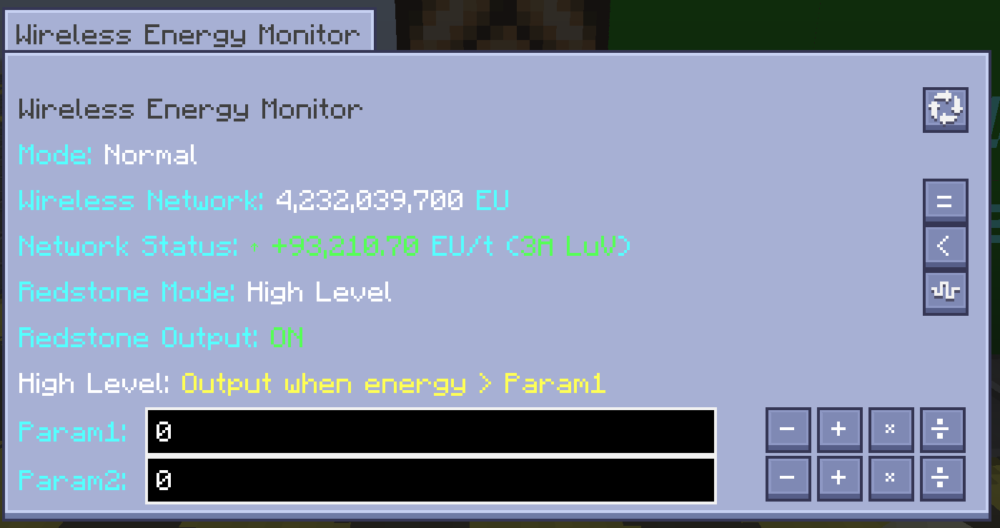
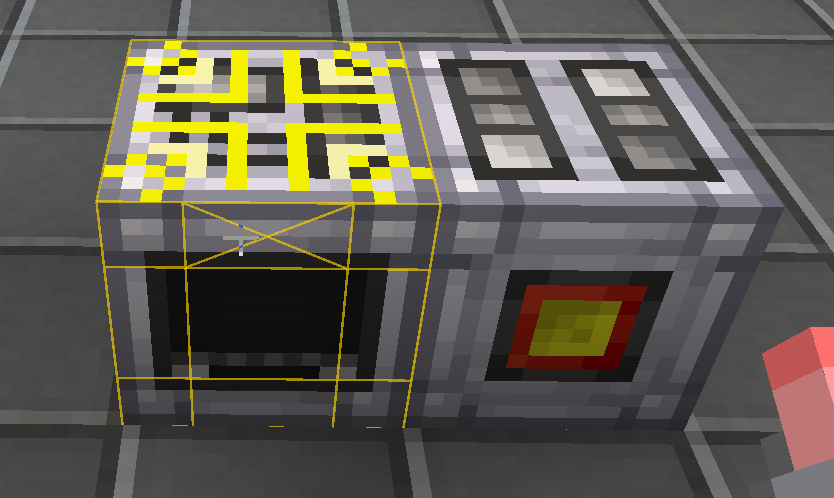
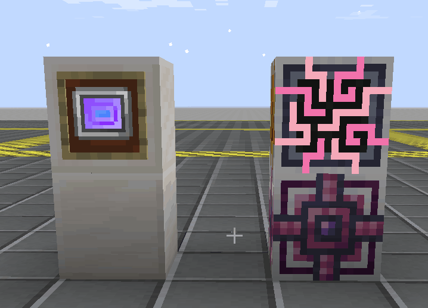
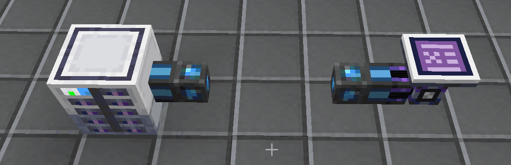

<h1 align="center">GT-Simple-Wireless-Network</h1>

<strong><em>GTNH 无线电网模组</em></strong>

一个 GregTech New Horizons 模组，为 GTNH 无线 EU 网络添加**无线能量监控、传输和红石控制**。提供便携式和方块式监视器、无线网络链路终端和链路终端覆盖板（能源/动力）——全部可在 LV 阶段合成——实现智能电网分析、红石逻辑输出和任意机器的无线能量传输。

> \[!NOTE]
> 这是一个非官方模组，讨论此模组时请注意场合。

## 下载与版本需求

| GTNH         | GTSWN  | 维护 |
| ------------ | ------ | :--: |
| 2.9.0 beta-1 | 1.0.0+ | ✔️  |
| 2.8.4        | 0.2.0+ | ✔️  |

***

## 无线能量监视器

  <em>无线能量监视器</em>

无线能量监视器，单方块机器，实时显示无线电网能量状态 （每五秒），具备高级红石控制（可以以电网容量或者电网状态为指标）。支持5种红石模式（关闭/高电平/低电平/正向滞后/反向滞后），参数化阈值设定，状态贴图动态切换。其还可以连接工业信息屏。

- **红石模式**: 关闭 → 高电平（电量 > 阈值时输出）→ 低电平（电量 < 阈值时输出）→ 正向滞后 → 反向滞后
- **显示模式**: 常规计数（1,234,567 EU）/ 科学计数（1.235×10^6 EU）
- **智能EU/t**: 实时变化率 + GT 风格电流与电压等级显示（如 "2A HV"）

  <em>中文界面（上）与英文界面（下）</em>

***

## 便携无线监测终端

背包内（含任意 Baubles 饰品栏）自动显示 HUD 的手持设备。实时显示无线电网能量、EU/t 变化率和 GT 风格功率等级——无需放置任何方块。通过 C→S→C 网络包同步，在单人世界和专用服务器中均可正常使用。

- **支持饰品**: 可放入任意 Baubles 饰品槽；HUD 扫描顺序为主手 → 饰品栏 → 背包
- **服务器兼容**: 通过客户端请求 / 服务端响应的网络包同步，在专用服务器上正确显示电网数值

  <em>科学计数模式 — 充电状态（左）与放电状态（右）</em>

***

## 网络信息屏与拓展屏

网络信息屏，多方块显示面板，可视化无线电网能量趋势（8 个嵌套时间窗口：5 分钟 / 1 小时 / 8 小时 / 24 小时 / 7 天 / 1 月 / 3 月 / 1 年）。由主屏和拓展屏组成，可拼接成任意矩形尺寸的连续屏幕。采用 Fritsch-Carlson 单调三次 Hermite 样条曲线平滑渲染趋势，支持多屏间按玩家 UUID 共享数据。

  <em>网络全天候检测示意图</em>

- **多方块屏幕**: 主屏 + 拓展屏拼成连续实心矩形；拓展屏自动附着相邻主屏
- **8 时间窗口**: 5m / 1h / 8h / 24h / 7d / 1M(28d) / 3M(84d) / 1Y(336d) 数据集，各为 61 点 FIFO，按**自然比例**均值流入链（12→8→3→7→4→3→4）；窗口自动填满并淘汰最旧数据，无需手动清理
- **请求驱动采样**: v1.5.17 起，信息屏每 tick 通过 `updateRequestTick` 通知数据集"我在线"，调度器只对 5 分钟内有请求的数据集采样；超时自动停止采样，无需安全网清理
- **样条曲线**: Fritsch-Carlson 单调三次 Hermite 样条，平滑度可配置（0-12 → 4-26 段）
- **玩家共享**: 数据集绑定玩家 UUID；多块屏幕显示同一份数据
- **可配置背景**: 自定义屏幕背景色；留空禁用 TESR 填充
- **显示模式**: 常规计数（1,234,567）/ 科学计数（1.23E6）/ 千位计数（1.23K），**默认科学计数**

### AE 走势图

AE 走势图，绑定 AE 网络中的特定物品或流体，可视化其存量与变化率趋势。双 Y 轴显示（左=存量蓝、右=变化率橙），支持 8 时间窗口（5m/1h/8h/24h/7d/1M/3M/1Y），与 EU 走势图共用相同的自然比例流入链。手持物品/流体右键信息屏即可绑定。简报区**居中显示且可缩放**（复用 `briefRatio`），显示当前存量、实时变化速率、平均变化速率（基于 61 点首尾差值法）。

 <em>AE 走势图</em>

- **双 Y 轴**: 左轴 = 存量（蓝），右轴 = 变化率（橙，与无线 EU 网络 EU/t 线颜色一致）
- **居中简报**: v1.5.17 起简报文字居中绘制，GUI 的 `+/-` 按钮复用 `briefRatio` 控制字号（与 EU 走势图一致），点击时长标签按钮切换 8 时间窗口
- **简报区**: 当前存量 + 实时变化速率 + 平均变化速率（61 点首尾差值）
- **可配置**: Y 轴最小/最大值、线宽、样条平滑度、背景色、线色、线可见性开关

### AE 实时监测

AE 实时监测，同时监控多个 AE 物品/流体，可滚动列表显示。每行包含图标、名称、存量、实时变化率、300s 平均变化率。支持格子模式与可配置字号/加粗/图标大小。手持物品/流体右键信息屏即可添加监视项。

 <em>AE 实时监测</em>

- **可滚动列表**: 自定义 GUI 滚动列表，支持滚轮、拖动与滚动条
- **单项数据**: 图标 + 名称 + 存量 + 实时变化率 + 300s 平均变化率（首尾差值）
- **格子模式**: 备选的紧凑格子布局，格子大小可配置
- **在线状态**: 深绿色文字表示该 AE 物品在线且正在被监测

***

## 红石控制系统

无线能量监视器具备5模式红石控制系统：

| 模式   | 行为                 |
| ---- | ------------------ |
| 关闭   | 不输出红石信号            |
| 高电平  | 电量 > 阈值时输出信号       |
| 低电平  | 电量 < 阈值时输出信号       |
| 正向滞后 | >参数1时输出，必须<参数2才能取消 |
| 反向滞后 | <参数2时输出，必须>参数1才能取消 |

***

## 电网状态计算机制

**无线能量监视器**（方块）与**便携式无线网络监测终端**（物品）共享统一的电网状态计算机制。EU/t 基于 300 秒滚动窗口（61 点 FIFO，100t 采样间隔，BigDecimal 精确计算）的首末两点斜率计算。近零速率有特殊标签（`<1EU`、`静默`、`长期静默`），重载处理在冷启动重建期间维持红石输出。

***

## 无线网络链路终端与覆盖板

 <em>链路终端与覆盖板</em>

### 无线网络链路终端

便携物品，将任意机器连接到无线 EU 网络。Shift+右键切换能源模式（从电网获取，可配置损耗，默认15%）和动力模式（向电网输出，通过电容量缓冲池像虚拟导线般取电）。动态纹理反映当前模式。

- **九宫格辅助线**: 指向 GT 机器（ICoverable）时，绘制与 GT 扳手/覆盖板工具一致的九宫格辅助线——能源模式=黄色线，动力模式=紫色线。

 <em>九宫格辅助线</em>

### 链路终端（能源/动力）

两种覆盖板均为**虚空覆盖板**——无合成配方，仅作为由无线网络链路终端右击附着的 NBT 驱动覆盖板存在。其行为完全由右击赋予的 NBT 参数决定；裸覆盖板无参数时无效。所有 NBT 参数跨存档/退出持久化。

#### 链路终端（能源）

作为一个**虚拟电源**——内部维护电容量缓冲池，像导线一样持续向被绑定机器输入 EU。

- **电容量**: `V × A × 800` tick（配置时计算；配置后立即补满至上限）
- **每 tick 行为**: 向被绑定机器注入 `min(V × A, 机器所需, storedEU)` EU——行为与真实导线一致
- **补满**: 每 600 tick 从无线电网扣除 `(容量 − storedEU) × (1 + 下行损耗)` EU 补满缓冲池
- **特例**: 单方块电弧炉强制设定 4A（通过配方表 `RecipeMaps.arcFurnaceRecipes` 精确识别，而非类名）
- **卸载**: 覆盖板被移除时，剩余缓冲按 `(1 − 上行损耗)` 比例返还电网

#### 链路终端（动力）

作为一个**虚拟导线**——读取机器的输出存入内部缓冲池，并周期性上送到无线电网。电容量固定为 `2^63 − 1`。

- **电容量**: `Long.MAX_VALUE`（2^63 − 1）
- **每 tick 行为**: 读取机器的 `getOutputVoltage()` / `getOutputAmperage()`；若 V > 0，按 `min(可用电量, V × A)` 从机器取电入池（尊重 `getMinimumStoredEU()`）。无输出能力的机器（V = 0）自动跳过，避免从非输出机器取电。
- **阻断**: `letsEnergyOut() = false` 阻止机器向覆盖板所在面的真实导线输出，避免双重消耗
- **上送**: 每 600 tick 将缓冲池按 `(1 − 上行损耗)` 比例上送到无线电网
- **卸载**: 覆盖板被移除时，剩余缓冲按 `(1 − 上行损耗)` 比例返还电网

***

## ME 网络量子终端与节点

  <em>ME 网络量子终端（左）与量子节点（右）</em>

为 AE2 网络提供「量子化」远程接入机制。量子终端将成型的 ME 控制器整结构量子化并绑定其网络；量子节点作为远程接入点，经虚拟桥接接入锚点控制器网络——突破原版线缆距离限制，相邻 AE2 设备直接入网。

> ⚠️ 量子终端与量子节点均无合成配方，通过创造模式获取；节点仅能由已绑定终端右击空地放置。

### 量子终端

| 手势 | 行为 |
|---|---|
| 右击控制器 | 量子化并绑定整结构（已量子化则改绑） |
| Shift+右击控制器 | 取消量子化并解绑 |
| 右击空地（已绑定） | 放置量子节点 |
| Shift+右击节点 | 销毁节点（无掉落） |
| Shift+右击空气 | 打开终端界面 |

### 量子节点

- **远程桥接**: 经虚拟桥接接入锚点控制器 ME 网络，相邻 AE2 设备直接入网。
- **无频道上限**: 使用致密线缆容量（**32 频道/连接**），节点本身不消耗频道。
- **待机功耗**: 通过 `quantumNodeIdlePowerUsage` 配置（默认 10.0 AE/t）。
- **单维度**: v1 不支持跨维度桥接。

### 量子终端界面

v1.6.9 起精简为紧凑布局（120×92），仅显示三类核心信息：

| 项目 | 说明 |
|---|---|
| 控制器坐标 + 维度 | 锚点坐标与维度 |
| 量子节点数量 | 网络中量子节点数量 |
| 频道 | `已用 / 总数 (百分比%)`，过载时红色高亮 |

### 过载保护

当量子节点带入的频道总数超过控制器结构容量（`(n×6 − sharedFaces) × 32`）时，整个控制器结构 **TNT 级爆炸**；达到 95% 阈值时向节点放置者发送聊天警告。

### 量子化控制器强化

量子化后的 ME 控制器获得等效硬度（挖掘速度降至 1/1000）与等效防爆（400000），且对爆炸事件自动移除受影响方块——防止被意外破坏或爆破。

***

## 管理员命令

需要 OP 等级 4。

- **`/gtswn global_energy_trans <fromUUID> <toUUID>`** — 一次性将 fromUUID 网络的所有 EU 迁移到 toUUID 网络。用于玩家换账户（正版转第三方等）导致 UUID 变化后迁移 EU。

- **`/gtswn global_energy_join <memberUUID> <leaderUUID>`** — 通过 GT5U 团队系统（`SpaceProjectManager`）将玩家的网络永久加入另一个玩家的网络。加入后，成员的无线 EU 操作自动解析到队长的网络。

***

## 技术栈

- Java 25→8（JVM Downgrader）/ Minecraft 1.7.10 / Forge 10.13.4.1614
- 依赖: GT5-Unofficial、GTNHLib、StructureLib、ModularUI、ModularUI2

## 许可证

详见 LICENSE 文件。
